# LABORATORIO 4
## TEORÍA

### 1. Qué es la electrocardiografía

La electrocardiografía es el procedimiento que registra la actividad eléctrica del corazón. El corazón está compuesto por varios tejidos, entre ellos el músculo cardíaco, capaz de producir señales eléctricas que resultan detectables en la superficie de la piel mediante un sensor ECG.

Lo que el registro recoge no es el bombeo de sangre sino la actividad eléctrica que lo ordena.

### 2. Funcionamiento del corazón

El corazón bombea la sangre rica en oxígeno desde la aurícula izquierda hacia el ventrículo izquierdo y de ahí a la aorta. La sangre pobre en oxígeno se bombea desde la aurícula derecha hacia el ventrículo derecho y de ahí a los pulmones. Las contracciones miocárdicas regulares y repetitivas, que resultan de los potenciales de acción y de su propagación, son lo que permite al corazón funcionar como una bomba eficiente.

El recorrido del impulso sigue esta secuencia:

| Etapa | Estructura | Función |
|---|---|---|
| 1 | Nodo sinoauricular | Inicia la actividad eléctrica. Se ubica en la aurícula derecha posterior y actúa como marcapasos del corazón |
| 2 | Aurículas | Propagan el potencial de acción hacia el nodo auriculoventricular |
| 3 | Nodo auriculoventricular | Retrasa la propagación hacia los ventrículos debido a su conducción lenta |
| 4 | Ramas derecha e izquierda del haz | Conducen el impulso hacia el tejido ventricular |
| 5 | Fibras de Purkinje | Propagación muy rápida que activa las células ventriculares de forma simultánea |

La velocidad de propagación y el tamaño de los potenciales de acción dependen del tipo de canales iónicos y de su velocidad de apertura y cierre.

El ciclo cardíaco comprende la diástole, que es el rellenado de las cámaras con sangre, y la sístole, que es la contracción y vaciado de las cámaras.

### 3. Origen de la señal medible en la piel

La excitación de una célula del músculo cardíaco durante el ciclo cardíaco genera un dipolo, ya que la célula se vuelve más positiva respecto de sus vecinas, lo que da lugar a un vector eléctrico. Conforme la excitación se propaga a las células vecinas, esos vectores se suman y se genera un vector resultante.

Tanto durante la propagación como durante la regresión de la excitación, los desplazamientos de carga pueden medirse desde la superficie de la piel. Cada parte del corazón tiene un momento distinto de excitación y propagación, y eso es lo que determina los componentes de la señal electrocardiográfica.

### 4. Componentes del trazado

| Componente | Significado fisiológico |
|---|---|
| Onda P | Contracción y propagación de la excitación en las aurículas, es decir, despolarización auricular |
| Intervalo PQ | Propagación de la excitación desde las aurículas hacia el ventrículo |
| Complejo QRS | El ventrículo se contrae y propaga la excitación |
| Intervalo ST | El ventrículo está completamente excitado y la excitación comienza a regresar |
| Onda T | Regresión de la excitación en el ventrículo |
| Complejo TP | Aurículas y ventrículo sin excitar |

La señal se mide desde el electrodo negativo hacia el electrodo positivo. El tamaño de la amplitud depende del ángulo de la dirección del dipolo, mientras que el signo de la amplitud, positivo o negativo, depende del sentido de ese dipolo. Por esta razón el complejo QRS presenta amplitud alta y positiva cuando el dipolo apunta del electrodo negativo hacia el positivo.

### 5. Derivaciones

La técnica de medición estándar del electrocardiograma emplea doce derivaciones para cubrir la información del corazón en tres direcciones. Las tres primeras son las derivaciones bipolares de Einthoven, que representan el plano frontal mediante ambos brazos y la pierna izquierda. Las derivaciones unipolares aumentadas de los miembros, identificadas como aVR, aVL y aVF, también representan el plano frontal. Las seis derivaciones precordiales unipolares, de V1 a V6, representan el plano horizontal con electrodos ubicados en seis posiciones sobre el pecho.

Este laboratorio emplea las tres derivaciones de Einthoven, denotadas en los resultados como D1, D2 y D3:

| Derivación | Electrodo negativo | Electrodo positivo | Ángulo en el plano frontal |
|---|---|---|---|
| I | Brazo derecho, RA | Brazo izquierdo, LA | 0 grados |
| II | Brazo derecho, RA | Pierna izquierda, LL | 60 grados |
| III | Brazo izquierdo, LA | Pierna izquierda, LL | 120 grados |

Cada derivación observa el corazón desde un ángulo distinto. Por ello la forma y la amplitud de los componentes del trazado cambian entre una derivación y otra, aun cuando la actividad cardíaca sea la misma.

### 6. Colocación de los electrodos

El sensor de electrocardiografía dispone de tres cables. A diferencia del sensor de electromiografía empleado en el laboratorio anterior, este incorpora los dos cables de medición más el cable de referencia.

| Cable | Color | Función |
|---|---|---|
| IN+ | Rojo | Electrodo positivo |
| IN− | Negro | Electrodo negativo |
| REF | Blanco | Referencia |

La guía contempla tres ubicaciones posibles para los electrodos, y las tres sirven para cualquiera de las tres derivaciones:

1. Ambas muñecas y el tobillo izquierdo.
2. Ambas clavículas y la cresta ilíaca izquierda.
3. Todos sobre el pecho.

Para obtener la señal de mayor calidad y distinguir entre sí todos los complejos PQRS, los electrodos deben colocarse cerca del corazón, sobre el pecho.

En el registro de electrocardiografía los electrodos se ubican en regiones de baja actividad muscular, es decir, sobre hueso, con el fin de reducir el ruido de las activaciones musculares y los artefactos de movimiento.

Para pasar de la derivación I a la derivación II se intercambian entre sí el electrodo positivo y el de referencia. Para obtener la derivación III se parte del montaje de la derivación II y se intercambian entre sí el electrodo negativo y el de referencia.

### 7. Equipo y materiales

La adquisición se realizó con el kit BITalino (r)evolution y su sensor de electrocardiografía ensamblado, conectado a uno de los canales analógicos disponibles de la placa. La visualización y el registro se llevaron a cabo en el software OpenSignals (r)evolution.

Materiales empleados:

- Software OpenSignals (r)evolution
- Placa BITalino (r)evolution Assembled Core BT
- Sensor de electrocardiografía ensamblado
- Tres electrodos desechables autoadhesivos de Ag/AgCl con gel
- Adaptador Bluetooth

Se utilizan tres electrodos con gel por cada experimento. Conviene sustituirlos por nuevos cuando no se encuentren en buen estado. Antes de colocarlos se limpia la zona de piel con alcohol, con el fin de retirar partículas y mejorar la conductividad cutánea.

### 8. Condiciones evaluadas y fundamento

Los sistemas cardíaco y respiratorio se encuentran estrechamente interconectados, de modo que el patrón respiratorio modifica el registro electrocardiográfico. Por ese motivo el protocolo compara una condición de referencia en reposo con tres maniobras que alteran ese patrón.

| Condición | Maniobra realizada | Fundamento |
|---|---|---|
| Reposo | Sujeto sentado, relajado y sin movimientos | Establece la línea base con la que se comparan las demás condiciones |
| Hiperventilación | Respiración profunda y rápida durante 30 segundos | Modifica el intercambio gaseoso y el control autonómico del ritmo cardíaco |
| Hipoventilación | Inspiración profunda seguida de retención del aire | Situación opuesta a la anterior, con ausencia de movimiento torácico durante la retención |
| Ejercicio cardiovascular | Burpees durante 5 minutos | Eleva la demanda metabólica y con ella la frecuencia cardíaca |

Además del ritmo cardíaco, el movimiento del tórax durante la respiración modifica la distancia entre los electrodos situados en la piel y el corazón, lo que se refleja en la amplitud de los picos R. Esta es la base sobre la que puede estimarse la frecuencia respiratoria a partir del propio electrocardiograma.

### 9. Parámetros que se extraen del registro

| Parámetro | Forma de obtenerlo |
|---|---|
| Frecuencia cardíaca | Se determina a partir de los picos R y se expresa en latidos por minuto |
| Variabilidad de la frecuencia cardíaca | Se obtiene midiendo los intervalos de tiempo entre picos R sucesivos. Una variabilidad alta se asocia a mejor salud cardíaca general |
| Frecuencia respiratoria | Se detecta examinando la amplitud de los picos R, ya que el movimiento del tórax modifica la distancia entre los electrodos y el corazón |
| Elevación del segmento ST | Se identifica cuando la señal no retorna a la línea base tras el complejo QRS. Indica restricción en el aporte de oxígeno al tejido cardíaco y puede derivar en infarto de miocardio |

### 10. Preguntas

**Q1.** ¿Cuáles son las frecuencias significativas para la adquisición de EMG? ¿Son iguales en todas las áreas del cuerpo, como en la zona facial?

Las frecuencias significativas son de 50 a 150 Hz, ya que en este rango se concentra la mayor parte de la energía utilizable y fisiológicamente relevante de la señal EMG [1]. Las frecuencias significativas no son iguales para todas las áreas del cuerpo. Por ejemplo, en el rostro las frecuencias dominantes pueden encontrarse entre 100 y 250 Hz, mientras que en el brazo se encuentran principalmente entre 50 y 150 Hz [2]. Esto se debe principalmente a diferencias anatómicas y fisiológicas, como el tipo de fibras musculares, las unidades motoras, la geometría y la profundidad del músculo.

1. [https://www.researchgate.net/figure/Frequency-spectrum-of-EMG-signal_fig2_232905752](https://www.researchgate.net/figure/Frequency-spectrum-of-EMG-signal_fig2_232905752)
2. [https://pmc.ncbi.nlm.nih.gov/articles/PMC11816783/](https://pmc.ncbi.nlm.nih.gov/articles/PMC11816783/)

**Q2.** ¿Qué tipo de filtro es esencial al trabajar con señales de EMG? ¿Por qué es necesario aplicar este filtro?

Se utiliza un filtro pasa banda, que puede obtenerse mediante la combinación de un filtro pasa altos con frecuencia de corte cercana a 20 Hz y un filtro pasa bajos con frecuencia de corte cercana a 500 Hz [3]. Esto se realiza con la finalidad de conservar principalmente las frecuencias de interés dentro de la señal EMG. Este filtro es necesario para disminuir los artefactos de movimiento generados principalmente en frecuencias menores a 20 Hz y reducir el ruido de alta frecuencia presente por encima de aproximadamente 500 Hz.

3. [https://www.researchgate.net/figure/Frequency-spectrum-of-EMG-signal_fig2_232905752](https://www.researchgate.net/figure/Frequency-spectrum-of-EMG-signal_fig2_232905752)

**Q3.** ¿Cómo difiere la amplitud en cada tipo de contracción muscular? ¿Existe alguna diferencia según la ubicación en el cuerpo?

Según lo observado, cuando se contrae el músculo la amplitud de la señal EMG aumenta considerablemente en comparación con el momento en que el músculo se encuentra en reposo. Esto se debe a que durante la contracción existe una mayor activación y reclutamiento de unidades motoras, lo que se traduce en una mayor actividad eléctrica registrada por el EMG.

Según la ubicación del cuerpo, la amplitud de la señal EMG también puede ser distinta. Tal como se pudo observar en el brazo y en la pierna, en el brazo la actividad electromiográfica registrada fue mayor que en la pierna. Esta diferencia puede deberse a factores como la fuerza de contracción realizada, el número de unidades motoras reclutadas, la anatomía del músculo sensado y la posición de los electrodos.

**Q4.** Muestra una captura de pantalla de una sección relevante de los datos de Electromiografía (EMG) dentro del experimento propuesto en la Sección D para un músculo facial de interés. ¿Esta señal corresponde a lo que esperabas? ¿Por qué? ¿Qué emoción y acción realizaste para activar el músculo? ¿Qué músculo activaste?

> Insertar aquí la captura de pantalla correspondiente al registro EMG del músculo facial.

La señal obtenida corresponde a lo esperado si durante la activación del músculo facial se observa un incremento de la amplitud de la señal EMG respecto al período de reposo. Esto se debe al aumento de la actividad eléctrica producido por el reclutamiento de unidades motoras durante la contracción muscular.

Emoción realizada: [Completar según el experimento].

Acción realizada: [Completar según el experimento].

Músculo activado: [Completar según el experimento].

**Q5.** Hasta donde alcanza tu conocimiento, ¿es la amplitud de EMG igual a la cantidad de fuerza que has generado con tu músculo?

No exactamente. La amplitud de la señal EMG está relacionada con el nivel de activación muscular y generalmente aumenta cuando se incrementa la fuerza ejercida, debido al mayor reclutamiento y frecuencia de activación de las unidades motoras. Sin embargo, la amplitud de EMG no representa directamente la cantidad de fuerza generada por el músculo.

La relación entre la amplitud de EMG y la fuerza puede verse afectada por factores como el tipo de músculo, la posición de los electrodos, la fatiga muscular, el tejido existente entre el músculo y los electrodos y el tipo de contracción realizada. Por ello, la señal EMG puede utilizarse como una estimación de la actividad muscular, pero no debe interpretarse directamente como una medida de fuerza.

## RESULTADOS
### ECG EN REPOSO

Figura 1: Posición en reposo

El registro se realizó con el estudiante sentado en una silla con la espalda apoyada y el cuerpo relajado. Los brazos se colocaron descansando sobre los muslos y los pies planos sobre el suelo, manteniéndose quieto y en reposo durante la prueba para evitar movimientos musculares en el electrocardiograma. Con esta posición se realizaron los 3 registros.

#### DERIVADA 1

https://github.com/user-attachments/assets/f628d34b-dd42-46bc-8f33-f6d2f344a9b9

Video1: Grabación de la obtención del ECG en reposo (D1)

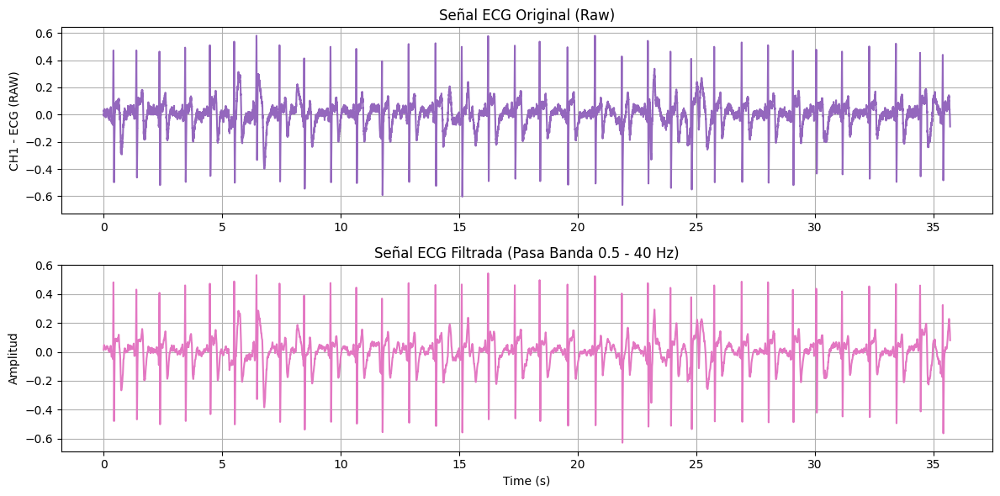

Figura1: Grafica señal ECG cruda (morado) y señal ECG filtrada (rosado) de la derivada 1 en reposo

#### DERIVADA 2

https://github.com/user-attachments/assets/1f2b7614-e7b6-4d53-8304-683f3b848696

Video2: Grabación de la obtención del ECG en reposo (D2)

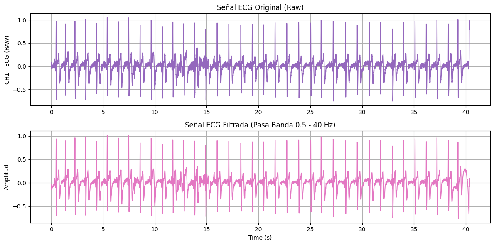

Figura2: Grafica señal ECG cruda (morado) y señal ECG filtrada (rosado) de la derivada 2 en reposo

#### DERIVADA 3

https://github.com/user-attachments/assets/d2fdd054-467a-4087-8104-fe7b318112fe

Video3: Grabación de la obtención del ECG en reposo (D3)

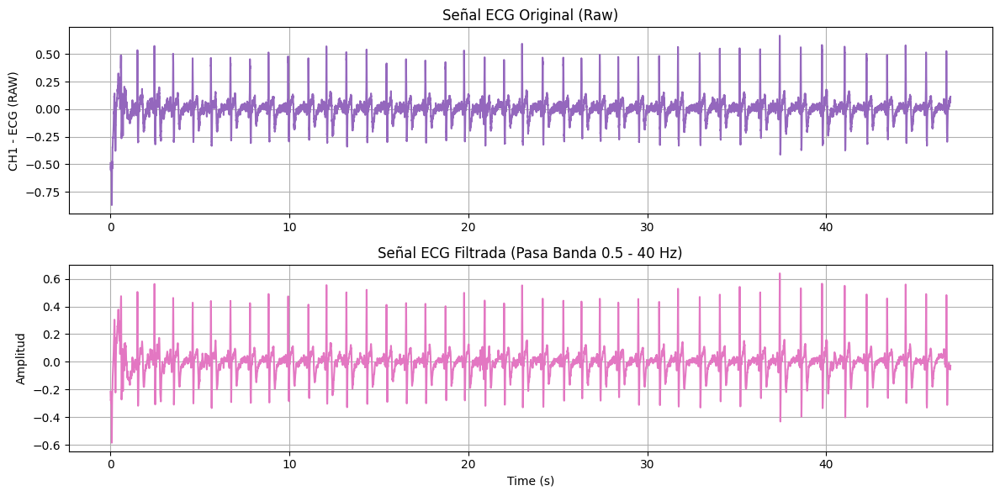

Figura2: Grafica señal ECG cruda (morado) y señal ECG filtrada (rosado) de la derivada 3 en reposo

### ECG LUEGO DE HIPERVENTILACIÓN

El registro se realizó con el estudiante en la misma posición. Se le indicó realizar una hiperventilación voluntaria, respirando de manera profunda y rápida durante 30 segundos, manteniendo la misma postura y evitando movimientos corporales bruscos durante el electrocardiograma para los 3 registros.

#### DERIVADA 1

https://github.com/user-attachments/assets/32d2daf6-ae44-4ffe-a135-9df556e0aecc

Video4: Grabación de la obtención del ECG luego de hiperventilación (D1)

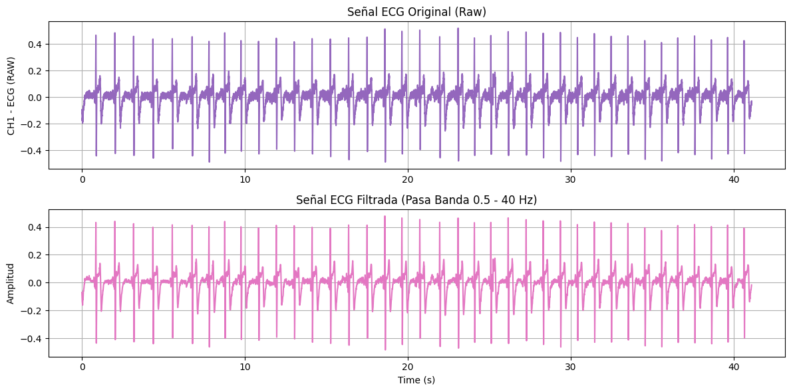

Figura4: Grafica señal ECG cruda (morado) y señal ECG filtrada (rosado) de la derivada 1 post-hiperventilación

#### DERIVADA 2

https://github.com/user-attachments/assets/ff9c6556-9c82-4c73-a654-c1c4e39d3e70

Video5: Grabación de la obtención del ECG luego de hiperventilación (D2)

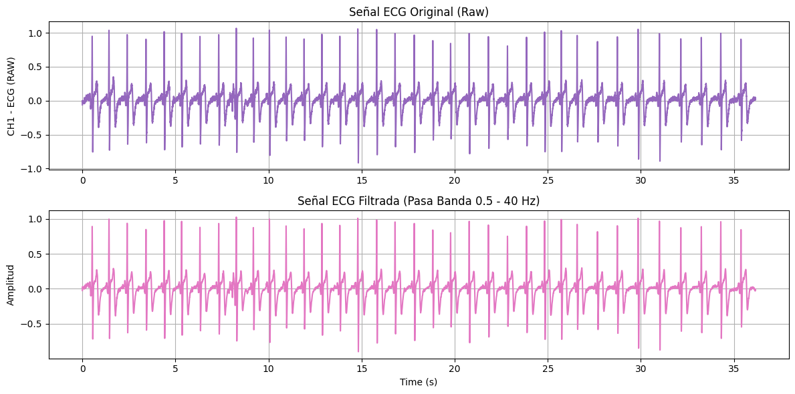

Figura5: Grafica señal ECG cruda (morado) y señal ECG filtrada (rosado) de la derivada 2 post-hiperventilación

#### DERIVADA 3

https://github.com/user-attachments/assets/eb3d9747-d237-4f7d-a0ae-d785693266b2

Video6: Grabación de la obtención del ECG luego de hiperventilación (D3)

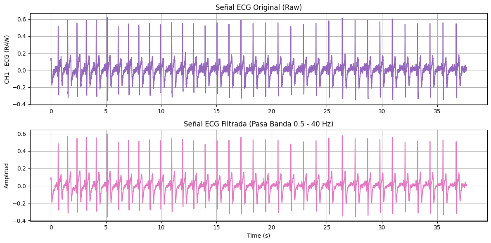

Figura6: Grafica señal ECG cruda (morado) y señal ECG filtrada (rosado) de la derivada 3 post-hiperventilación

### ECG LUEGO DE HIPOVENTILACIÓN

El registro se realizó manteniendo la posición. Se le indicó realizar una hipoventilación voluntaria, respirando profundamente y manteniendo el aire, para cada registro; cabe mencionar que entre los 3 registros se tuvo un tiempo de reposo de 30 segundos. Para las 3 derivaciones se obtuvo un periodo promedio de retención de aire de 1 minuto con 20 segundos.

#### DERIVADA 1

https://github.com/user-attachments/assets/67a884ac-d969-404a-a6b8-6c59c11d6450

Video7: Grabación de la obtención del ECG luego de hipoventilación (D1)

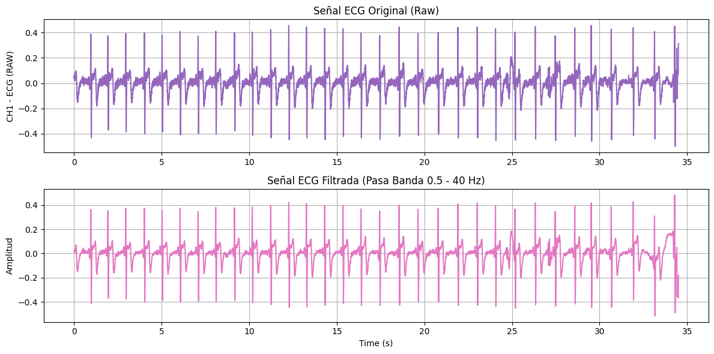

Figura7: Grafica señal ECG cruda (morado) y señal ECG filtrada (rosado) de la derivada 1 post-hipoventilación

#### DERIVADA 2

https://github.com/user-attachments/assets/e831cdd7-40a3-44de-84b4-f9c6fbc6540a

Video8: Grabación de la obtención del ECG luego de hipoventilación (D2)

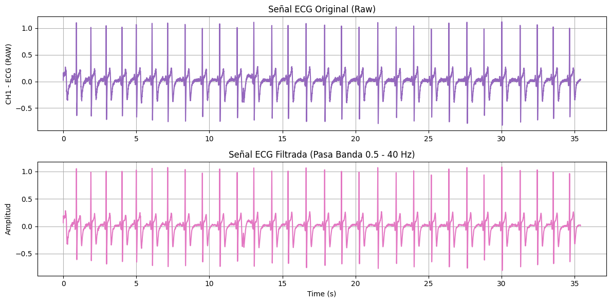

Figura8: Grafica señal ECG cruda (morado) y señal ECG filtrada (rosado) de la derivada 2 post-hipoventilación

#### DERIVADA 3

https://github.com/user-attachments/assets/99a9f194-64ac-4c47-8d30-c3e55e6ecb78

Video9: Grabación de la obtención del ECG luego de hipoventilación (D3)

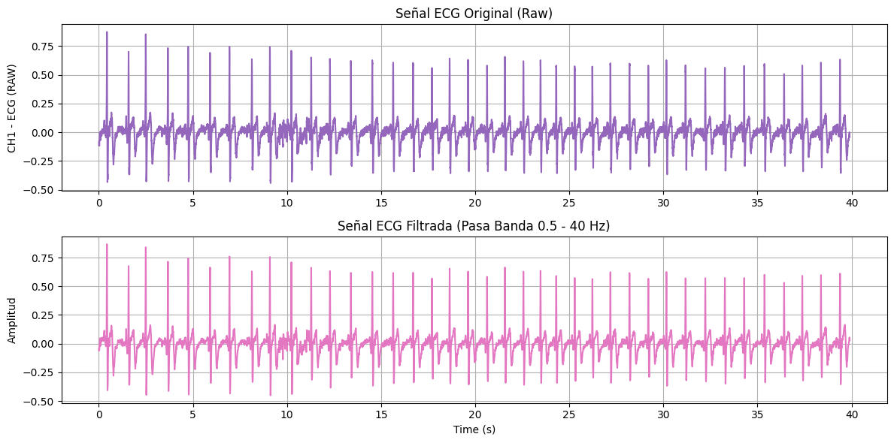

Figura9: Grafica señal ECG cruda (morado) y señal ECG filtrada (rosado) de la derivada 3 post-hipoventilación

### ECG LUEGO DE EJERCICIO CARDIO
El ejercicio realizado fue burpee, que combina peso corporal, flexiones y sentadillas. Este ejercicio aumenta la frecuencia cardíaca muy rápido porque el cuerpo hace cambios de nivel significativos. Este ejercicio fue realizado durante 5 minutos y solo fue realizado una vez; inmediatamente luego de su culminación se procedio a la realización de los 3 registros de manera secuencial.

https://github.com/user-attachments/assets/49989f37-01af-4768-a8e4-49642aa5a832

Video 10: Grabación del ejercicio realizado

#### DERIVADA 1

https://github.com/user-attachments/assets/ac8b715d-68f4-4e14-8d30-069b668b30b1

Video 11: Grabación de la obtención del ECG luego de ejercicio cardio (D1)

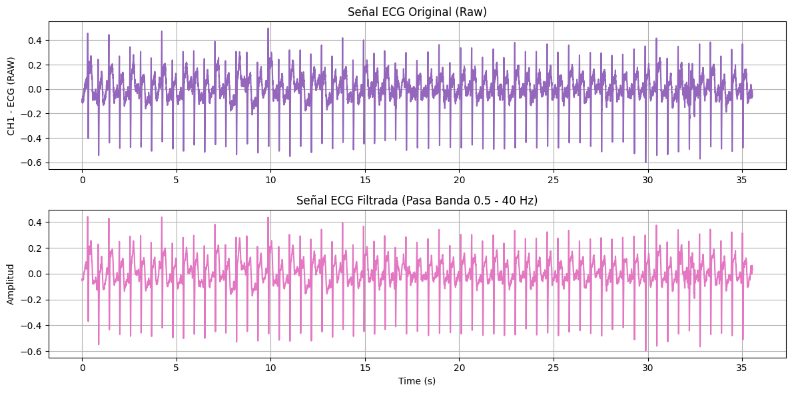

Figura10: Grafica señal ECG cruda (morado) y señal ECG filtrada (rosado) de la derivada 1 post-cardio

#### DERIVADA 2

https://github.com/user-attachments/assets/62eb47bb-b970-4988-9899-3c817e9af570

Video 12: Grabación de la obtención del ECG luego de ejercicio cardio (D2)

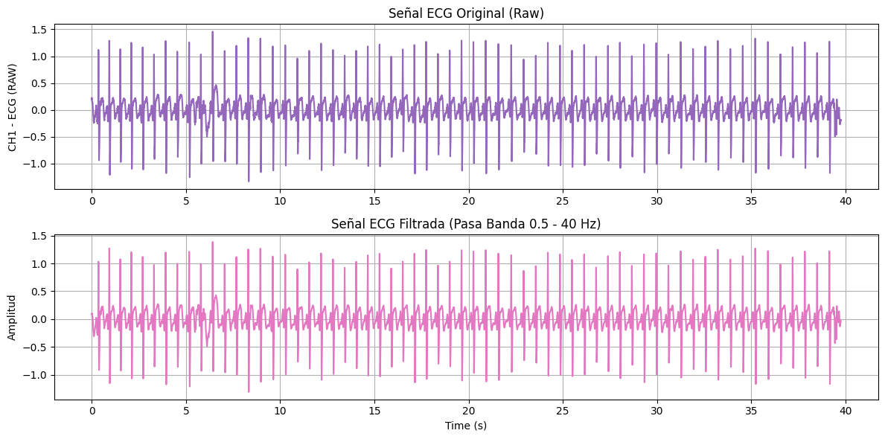

Figura11: Grafica señal ECG cruda (morado) y señal ECG filtrada (rosado) de la derivada 2 post-cardio

#### DERIVADA 3

https://github.com/user-attachments/assets/625bc2b4-68b3-4f26-b253-87bbdaf5a8b1

Video 13: Grabación de la obtención del ECG luego de ejercicio cardio (D3)

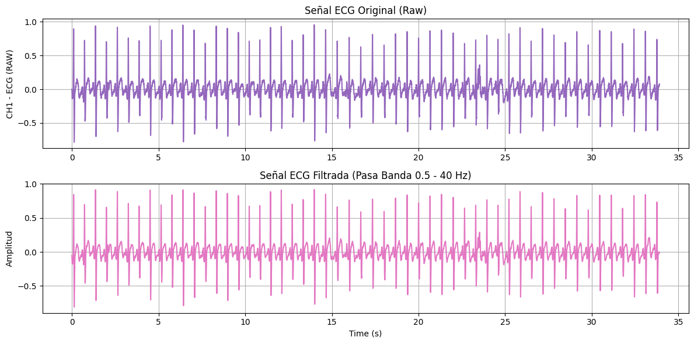

Figura12: Grafica señal ECG cruda (morado) y señal ECG filtrada (rosado) de la derivada 3 post-cardio

