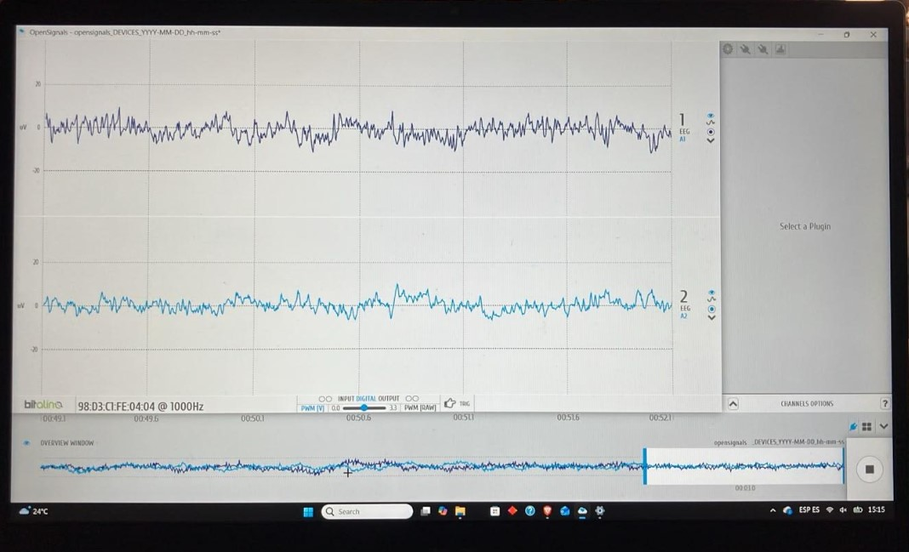
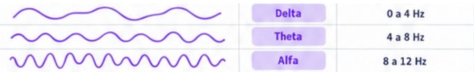
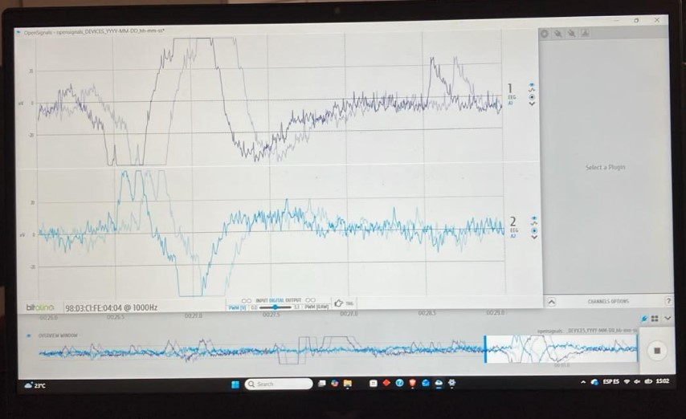

# LABORATORIO 5
## TEORÍA

### . Preguntas

**P1. ¿Cuáles son las frecuencias significativas para las adquisiciones de EEG? ¿Son las mismas en todas las áreas del cerebro?**
Las frecuencias significativas para la adquisición de EEG son de 0 a 25 Hz teniéndose diferencias entre las frecuencias delta, theta y alfa comprendidas entre 0 a 8 Hz las cuales miden el estado de reposo y reflexivo y las frecuencias beta y gamma, comprendidas de 12 Hz a 25 Hz, indican mayor concentración y una mente ocupada. Las frecuencias no son las mismas en todas las áreas del cerebro, ya que cambian de acuerdo a la posición de los electrodos y el potencial liberado en la zona del cerebro. 

**P2. ¿Qué tipo de filtro es esencial cuando se trabaja con señales de EEG? ¿Por qué necesitamos aplicar dicho filtro?**
El filtro pasa banda de 0.8 a 48 Hz es esencial para este tipo de señales debido al efecto de la ganancia elevada del dispositivo el sensor es sensible al ruido externo, luz, movimientos y la red eléctrica. Estas interferencias están comprendidas en las frecuencias de 50 a 60 Hz aproximadamente.

**P3. ¿Puedes influir en la señal de EEG mediante tus pensamientos? ¿Qué acción puedes realizar para activar la banda de frecuencia que elijas? ¿Pudiste visualizar el cambio en la señal?**
Es posible influir en la señal de EEG ya que las frecuencias están asociadas a distintos potenciales postsinápticos captados a frecuencias determinadas para el estado de relajación y el estado de pensamiento. Dentro de las acciones que se podría realizar para activar una determinada banda de frecuencia está el reposo y la somnolencia para activar las bandas alfa delta o theta y un estado de pensamiento activo y estrés para activar las bandas beta y gamma.

**P4. Muestra una captura de pantalla de una porción relevante de los datos de EEG dentro del experimento propuesto. ¿Se corresponde esta señal con lo que esperabas? ¿Por qué?**

Figura4: Imagen señal EOG cruda de prueba 4 en Open Signal.

En esta imagen se observa la señal EEG de una persona en reposo, las señales esperadas serían las siguientes:

Figura4: Imagen representación grafica de ondas cerebrales Delta, Theta y Alfa.

Vemos una diferencia relevante debido al ruido que puede presentarse en el entorno donde fue tomada la señal además de errores de conexión del EEG al paciente.

**P5. ¿Existe alguna diferencia en la señal entre las dos ubicaciones, FP1 y FP2?**
Si, la principal diferencia es que FP1 se encuentra en el lóbulo izquierdo y FP2 en el derecho. Los notación FP refiere a que se ubican ambos en la región frontopolar y la notación de números indica para los impares la ubicación en la izquierda y los pares en la derecha. 

**P6. ¿Qué frecuencias se supone que deben cambiar en las tareas asignadas? ¿Puedes ver estos cambios específicos en la señal en bruto (RAW)? Describe lo que ves.**

Figura4: Imagen señal EOG cruda en Open Signal.

Las frecuencias que deberían cambiar son las comprendidas de 0 a 12 Hz y verse las producidas de 12 Hz a 25 Hz. En la señal presentada se puede ver un cambio significativo en las frecuencias respecto a la señal de reposo, esta figura corresponde a la actividad donde se pregunta algo intrigante a la persona, el pico es la fase de pensamiento inicial y la señal más atenuada corresponde a fase de concentración.

**P7. Según tus conocimientos, ¿la amplitud del EEG equivale al nivel de concentración/enfoque que has aplicado?**
La amplitud suele ser proporcional al nivel de concentración sin embargo con lo experimentado en el laboratorio vemos que en algunos casos no se corresponde directamente, esto puede deberse a que no hay un reposo total en la persona o un estrés tan elevado como se esperaría para activar un potencial postsináptico en la frecuencia esperada. 

## RESULTADOS

