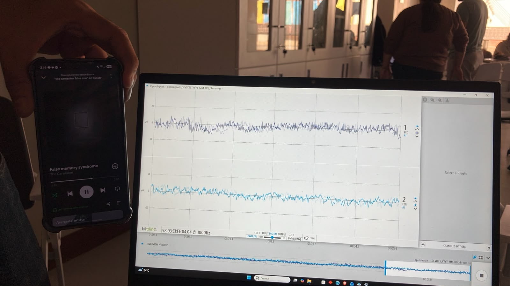
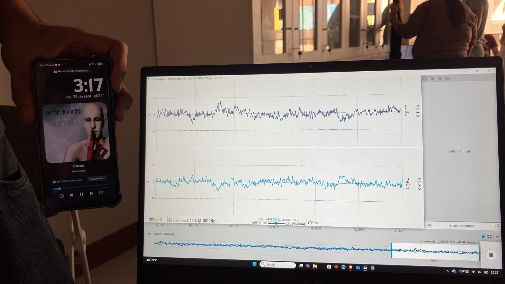

# LABORATORIO 6: Electroencefalografía

## TEORÍA

### 1. Qué es la electroencefalografía

La electroencefalografía registra la actividad eléctrica del cerebro mediante electrodos colocados sobre el cuero cabelludo. Cada electrodo recoge una señal propia del área cerebral situada bajo él, de modo que la ubicación de los electrodos determina qué región se está observando.

De la señal registrada se extrae la magnitud de las bandas de frecuencia asociadas, lo que permite evaluar la influencia de tareas específicas sobre la actividad cerebral. Esta es la diferencia de fondo respecto de otras bioseñales: el electrocardiograma se interpreta por la morfología de un trazado que se repite latido a latido, mientras que el electroencefalograma se interpreta por el reparto de energía entre bandas de frecuencia a lo largo del tiempo.

### 2. Origen de la señal

El cerebro humano tiene alrededor de 85 mil millones de neuronas, responsables de la mayor parte de la comunicación a través de las sinapsis situadas en el extremo de los axones. La información disparada libera neurotransmisores que provocan un cambio de voltaje a lo largo de la membrana celular, y se genera un campo eléctrico de apenas unos cientos de milisegundos, denominado potencial postsináptico.

El tipo celular determinante para medir campos eléctricos desde el cuero cabelludo es la neurona piramidal, cuya actividad resulta suficientemente intensa para atravesar las distintas capas de tejido. Esto se debe a su orientación específica, perpendicular a la superficie cortical, que hace que los campos de muchas neuronas vecinas se sumen en lugar de cancelarse.

De ahí se deriva una consecuencia práctica. Lo que llega al electrodo no es la actividad de una neurona concreta sino la suma espacial de millones de potenciales postsinápticos sincronizados. Una señal de amplitud muy reducida que, además, atraviesa el cráneo y el cuero cabelludo antes de alcanzar el sensor.

### 3. Organización funcional del cerebro

El cerebro se compone de cuatro lóbulos superficiales, cada uno con funciones diferenciadas.

| Lóbulo | Ubicación | Función |
|---|---|---|
| Frontal | Región anterior | Movimientos voluntarios, decisiones, pensamientos, procesamiento cognitivo como la planificación y la atención. Se le conoce como el centro de la personalidad |
| Temporal | Región lateral | Procesamiento sensorial, memoria a largo plazo, memorias visuales, emoción y lenguaje |
| Parietal | Región superior posterior | Integra la información procedente del entorno y su relación con el cuerpo, por ejemplo la coordinación de las manos al sujetar un objeto |
| Occipital | Parte posterior del cráneo | Procesamiento visual |

Esta distribución explica por qué la elección de la posición de los electrodos no es indiferente. Una tarea cognitiva se refleja con mayor claridad en derivaciones frontales, mientras que una tarea visual lo hace en derivaciones occipitales.

### 4. Bandas de frecuencia

Cinco subbandas definen las frecuencias del electroencefalograma medidas desde el cerebro, siendo gamma la más rápida y delta la más lenta.

| Banda | Frecuencia | Estado asociado | Tareas y estudios |
|---|---|---|---|
| Delta | 0 a 4 Hz | Sueño y ensoñación | Estudios del sueño |
| Theta | 4 a 8 Hz | Somnolencia | Prueba N-back, navegación espacial |
| Alfa | 8 a 12 Hz | Estado reflexivo y de reposo | Meditación, entrenamiento por biofeedback, atención |
| Beta | 12 a 25 Hz | Mente activa y ocupada | Control motor, alerta inducida por estimulantes |
| Gamma | Mayor a 25 Hz | Resolución de problemas, concentración | Estudios de microsacadas |

Las oscilaciones de la banda delta aparecen en distintas fases del sueño, y la potencia de esta banda guarda correlación con la profundidad del sueño.

Las frecuencias theta se originan en el tálamo y resultan más intensas en el lado derecho del cerebro. Se asocian al área frontal y guardan correlación con las tareas mentales, de modo que la potencia de banda aumenta con la dificultad de la tarea. Pueden medirse en todas las áreas corticales.

Las oscilaciones de la banda alfa reflejan funciones relacionadas con la memoria, lo motor y lo sensorial. Su potencia aumenta con la relajación en vigilia, por ejemplo al cerrar los ojos durante la meditación. En sentido inverso, las ondas alfa se suprimen al abrir los ojos y durante la actividad física o mental. Esta supresión es un fenómeno robusto y constituye el efecto más fácilmente observable en una sesión de laboratorio.

Las ondas beta se generan en las regiones posterior y frontal, y guardan correlación con el pensamiento activo y la concentración. A mayor concentración, las oscilaciones beta disparan a mayor frecuencia.

La banda gamma agrupa las frecuencias superiores a 25 Hz. Su origen y lo que reflejan no están claramente establecidos, y distintos estudios proponen interpretaciones diversas, entre ellas el reflejo de los movimientos oculares.

### 5. Sistema internacional 10-20

El sistema internacional 10-20 es el método reconocido para describir las posiciones de los electrodos sobre el cuero cabelludo. La distancia total entre el nasion, situado en el puente de la nariz, y el inion, la prominencia ósea de la parte posterior del cráneo, así como la distancia entre el lado derecho y el izquierdo, se definen como el 100 por ciento. Las cifras 10 y 20 describen la separación entre electrodos adyacentes expresada en porcentaje.

Cada posición se identifica con una letra y un número. La letra indica el lóbulo, con F para frontal, T para temporal, C para central, P para parietal y O para occipital. El número indica el hemisferio: los impares corresponden al izquierdo y los pares al derecho. La línea media se identifica con la letra z, de cero.

Para localizar las referencias anatómicas basta recorrer el cuello con el dedo hacia arriba hasta notar una depresión; justo encima se encuentra el inion, que sobresale. El nasion corresponde al puente de la nariz.

Existen gorros con electrodos preensamblados que garantizan un posicionamiento óptimo, especialmente útiles cuando se requiere registrar la actividad de todo el cerebro. Su preparación y ajuste resultan sin embargo muy costosos en tiempo, ya que la medición es monopolar y cada electrodo debe fijarse al cuero cabelludo con pasta conductora. Cuando se conoce de antemano qué área se desea observar, resulta más práctico emplear sensores individuales con electrodos pregelificados.

### 6. Configuraciones de medición

Existen dos técnicas posibles para medir la actividad cerebral desde el cuero cabelludo. La configuración monopolar emplea un electrodo por área cerebral más un electrodo de referencia. La configuración bipolar emplea dos electrodos de medición, identificados como IN+ e IN−, y mide la diferencia de potencial entre dos electrodos adyacentes. A esta configuración debe añadirse un electrodo de referencia situado sobre una zona ósea.

El sensor empleado en esta práctica es bipolar. Los dos electrodos de medición se colocan sobre la posición frontal, con una separación fijada por los broches del propio sensor, y la referencia se sitúa en una región neutra, sobre el hueso situado detrás de la oreja.

La lógica de la medición diferencial es la misma que opera en otras bioseñales de baja amplitud: el ruido que alcanza por igual a ambos electrodos de medición se cancela al restarlos, mientras que la diferencia de actividad entre ambos puntos sobrevive.

### 7. Características del sensor

| Parámetro | Valor |
|---|---|
| Filtrado pasa banda | 0.8 a 48 Hz |
| Ganancia | 40000 |
| Configuración | Bipolar, dos electrodos de medición más referencia |
| Electrodos requeridos | Dos con gel para el sensor y uno con gel para la referencia |

La señal medida es la diferencia amplificada entre las dos señales de medición, filtrada en banda de 0.8 a 48 Hz con el fin de eliminar las señales comunes no deseadas.

La ganancia de 40000 es el dato que condiciona todo el resto del procedimiento. Amplificar cuarenta mil veces convierte al sensor en un instrumento extraordinariamente sensible a los artefactos del entorno, entre ellos la luz, los movimientos y el ruido de red eléctrica de 50 o 60 Hz procedente de las fuentes de alimentación. Resulta por tanto imprescindible establecer un entorno adecuado para garantizar el funcionamiento óptimo del sensor.

La frecuencia de muestreo debe fijarse en un valor apropiado al ancho de banda del sensor según el teorema de Nyquist y Shannon, es decir, como mínimo el doble de la frecuencia máxima de la banda de interés.

### 8. Control de artefactos

El electroencefalograma es, de las bioseñales abordadas en el curso, la más vulnerable a la contaminación. La razón es doble: su amplitud es la menor de todas y la ganancia necesaria para hacerla visible amplifica por igual la señal y el ruido.

El sujeto debe suprimir cualquier activación muscular mientras se realiza la adquisición, con atención especial al área facial, donde los movimientos oculares y el parpadeo generan deflexiones de amplitud muy superior a la actividad cerebral, así como a los movimientos de cuello y mandíbula, es decir, apretar los dientes o masticar.

Una medida eficaz consiste en situar una cruz grande frente al sujeto para que fije la vista en ella mientras realiza la tarea, siempre que la tarea no se presente visualmente. Fijar la mirada en un punto reduce de forma directa los movimientos oculares, que son la fuente de artefacto más frecuente en registros frontales.

Para documentar los artefactos se recomienda adquirir simultáneamente electrooculografía, electromiografía y electrocardiografía cuando se dispone de esos sensores. Los artefactos de movimiento también pueden registrarse con una cámara de video o anotarse por segmento temporal, lo que permite después descartar los tramos afectados.

La piel debe prepararse adecuadamente antes de adherir los electrodos. Conviene desinfectarla para retirar las partículas de piel muerta y, cuando sea necesario, retirar el cabello de la zona.

Activaciones musculares muy pequeñas, como un movimiento ocular o un gesto de la mandíbula, bastan para producir artefactos en la señal. Por ello la relajación completa de la musculatura no es una recomendación accesoria sino una condición de validez del registro.

### 9. Aplicaciones

En el ámbito médico, la electroencefalografía se emplea habitualmente para el diagnóstico de trastornos o enfermedades cerebrales que producen anomalías visibles en la señal, como ocurre con la epilepsia o con los trastornos del sueño.

Resulta también útil en el contexto de las interfaces cerebro computadora, por ejemplo en pacientes con lesión medular, ictus de tronco encefálico o esclerosis lateral amiotrófica, que se encuentran encerrados en sus cuerpos sin posibilidad de comunicarse. Estos pacientes con discapacidad motora grave requieren métodos alternativos de comunicación. La interfaz extrae características de las señales cerebrales y con ellas acciona dispositivos externos como un interruptor, una prótesis o una computadora.

Un ejemplo sencillo de característica es la extracción de la potencia de la banda alfa, que representa la magnitud de las frecuencias alfa presentes en la señal cerebral. Con los ojos cerrados, las ondas alfa pueden distinguirse con claridad, lo que convierte a esta característica en la más accesible para una primera aproximación.

---

## METODOLOGÍA

### 10. Equipo y montaje

La adquisición se realizó con el kit BITalino (r)evolution y su sensor de electroencefalografía ensamblado, conectado junto con el cable de referencia a dos de los canales analógicos disponibles de la placa. La visualización y el registro se llevaron a cabo en el software OpenSignals (r)evolution.

Materiales empleados:

- Software OpenSignals (r)evolution
- Placa BITalino (r)evolution Assembled Core BT
- Sensor de electroencefalografía ensamblado
- Cable de electrodo de un hilo para la referencia interna
- Tres electrodos desechables autoadhesivos de Ag/AgCl con gel
- Adaptador Bluetooth

Se emplean dos electrodos con gel para el sensor y uno para el cable de referencia. Conviene sustituirlos por nuevos cuando no se encuentren en buen estado. Antes de colocarlos se limpia la zona con alcohol, con el fin de retirar partículas de piel y mejorar la conductividad cutánea.

Los dos electrodos de medición se situaron sobre la posición frontal del sistema 10-20, con la separación fijada por los broches del sensor ensamblado, y el electrodo de referencia sobre la región ósea situada detrás de la oreja.

### 11. Fundamento del diseño de la sesión

La sesión se estructuró en cuatro bloques, cada uno orientado a provocar un cambio identificable en una banda concreta y, al mismo tiempo, a controlar las variables que podrían enmascararlo.

El sujeto permaneció aislado sensorialmente mediante antifaz y oclusión auditiva durante toda la sesión. Esta decisión persigue dos objetivos. El primero es eliminar los estímulos visuales y auditivos no controlados, que de otro modo activarían las áreas occipital y temporal de forma impredecible. El segundo es garantizar que el único estímulo presente en cada bloque sea el que se pretende evaluar, de manera que el cambio observado en la señal pueda atribuirse a esa tarea y no al entorno.

**Lectura basal.** Se registró entre uno y dos minutos con los estímulos externos anulados. Este tramo no persigue observar ningún fenómeno sino establecer el nivel de referencia del sistema. En ausencia de tarea, lo que queda registrado es la actividad de fondo del sujeto sumada al ruido del montaje, de modo que la calidad de este tramo determina si los bloques posteriores son interpretables. Una línea base con oscilaciones amplias advierte de un problema de contacto o de interferencia antes de que se invierta tiempo en las maniobras siguientes.

**Ciclos de apertura y cierre de ojos.** Se realizaron cinco repeticiones con cinco segundos entre el cierre y la apertura, manteniendo la vista centrada en un punto fijo. Este bloque busca el fenómeno más documentado del electroencefalograma: el aumento de la potencia de la banda alfa con los ojos cerrados y su supresión al abrirlos. La fijación de la mirada en un punto durante la fase de ojos abiertos cumple la función descrita en el apartado de artefactos, ya que sin ella los movimientos oculares introducirían ruido precisamente en la fase que se desea comparar. La repetición en cinco ciclos permite además verificar que el efecto es consistente y no un hallazgo aislado.

**Preguntas complejas.** Se retiró únicamente uno de los tapones auditivos y se susurraron cinco preguntas complejas, sin solicitar respuesta inmediata y dejando un margen de reflexión de quince a veinte segundos. Cada elemento de este protocolo responde a una razón. Retirar un solo tapón mantiene la atenuación parcial del entorno y limita el estímulo auditivo a la voz del evaluador. Susurrar reduce la intensidad del estímulo sonoro, de modo que la respuesta registrada corresponda al procesamiento cognitivo y no a un sobresalto acústico. No solicitar respuesta verbal evita la activación de la musculatura facial y mandibular, que contaminaría el registro justo en el momento de mayor interés. El margen de reflexión proporciona una ventana suficientemente larga para que el esfuerzo cognitivo se sostenga y resulte visible en las bandas beta y gamma.

**Estímulos auditivos contrastados.** Se reprodujeron dos piezas musicales de carácter opuesto, una relajante y otra estruendosa, manteniendo el antifaz colocado. El contraste entre ambas permite comparar dos estados de activación dentro del mismo sujeto y la misma sesión, lo que elimina la variabilidad entre personas y entre montajes. Mantener el antifaz asegura que la diferencia observada proceda del estímulo auditivo y no de información visual concurrente.

El conjunto responde a un principio de diseño experimental: para atribuir un cambio en la señal a una tarea concreta es necesario que esa tarea sea lo único que varía entre un tramo y otro.

---

## RESULTADOS

### 1. SEÑAL EOG EN REPOSO (LÍNEA BASE)
El registro se realizó con el sujeto aislado sensorialmente, manteniendo la mirada fija y evitando movimientos oculares voluntarios para captar la señal basal.

  

Figura4: *Imagen sujeto en reposo en primer ejericio*.

### 2. SEÑAL EOG CON ESTÍMULO VISUAL (OJOS ABIERTOS Y CERRADOS)
El ejercicio consistió en pedirle al sujeto que observara un objeto con atención manteniendo los ojos abiertos durante 5 segundos y luego los cerrara durante 5 segundos, repitiendo este ciclo aproximadamente 5 veces (cubriendose los odios con audifonos inalambricos sin cancelacion de audio).

### 3. SEÑAL EOG ANTE PREGUNTAS COMPLEJAS (PROCESAMIENTO COGNITIVO)
Se le realizaron 5 preguntas complejas al sujeto sin que este verbalizara las respuestas. Para ello, se le retiró únicamente uno de los tapones de los oídos al momento de formular la pregunta, dándole un margen de 15 a 20 segundos para pensar en silencio antes de la siguiente interrogante.

### 4. SEÑAL EOG ANTE ESTÍMULOS AUDITIVOS (MÚSICA RELAJANTE VS. ESTRUENDOSA)
Se colocaron dos canciones a través de audífonos inalámbricos al sujeto (una considerada relajante y otra estruendosa), con una duración de 2 minutos por cada pista musical, manteniendo el antifaz puesto.

### 4. SEÑAL EOG ANTE ESTÍMULOS AUDITIVOS (MÚSICA RELAJANTE VS. ESTRUENDOSA)
Se colocaron dos canciones a través de audífonos inalámbricos al sujeto (una considerada relajante y otra estruendosa), con una duración de 2 minutos por cada pista musical, manteniendo el antifaz puesto.

  

Figura4: *Imagen señal en OpenSignal con musica tranquila*.

Como musica tranquila se elijio la cancion *False memory syndrome* de *The Caretaker*

  

## Preguntas

#### **P1. ¿Cuáles son las frecuencias significativas para las adquisiciones de EEG? ¿Son las mismas en todas las áreas del cerebro?**
Las frecuencias significativas para la adquisición de EEG son de 0 a 25 Hz teniéndose diferencias entre las frecuencias delta, theta y alfa comprendidas entre 0 a 8 Hz las cuales miden el estado de reposo y reflexivo y las frecuencias beta y gamma, comprendidas de 12 Hz a 25 Hz, indican mayor concentración y una mente ocupada. Las frecuencias no son las mismas en todas las áreas del cerebro, ya que cambian de acuerdo a la posición de los electrodos y el potencial liberado en la zona del cerebro. 

#### **P2. ¿Qué tipo de filtro es esencial cuando se trabaja con señales de EEG? ¿Por qué necesitamos aplicar dicho filtro?**
El filtro pasa banda de 0.8 a 48 Hz es esencial para este tipo de señales debido al efecto de la ganancia elevada del dispositivo el sensor es sensible al ruido externo, luz, movimientos y la red eléctrica. Estas interferencias están comprendidas en las frecuencias de 50 a 60 Hz aproximadamente.

#### **P3. ¿Puedes influir en la señal de EEG mediante tus pensamientos? ¿Qué acción puedes realizar para activar la banda de frecuencia que elijas? ¿Pudiste visualizar el cambio en la señal?**
Es posible influir en la señal de EEG ya que las frecuencias están asociadas a distintos potenciales postsinápticos captados a frecuencias determinadas para el estado de relajación y el estado de pensamiento. Dentro de las acciones que se podría realizar para activar una determinada banda de frecuencia está el reposo y la somnolencia para activar las bandas alfa delta o theta y un estado de pensamiento activo y estrés para activar las bandas beta y gamma.

#### **P4. Muestra una captura de pantalla de una porción relevante de los datos de EEG dentro del experimento propuesto. ¿Se corresponde esta señal con lo que esperabas? ¿Por qué?**

  

Figura4: *Imagen señal EOG cruda de prueba 4 en Open Signal*.

En esta imagen se observa la señal EEG de una persona en reposo, las señales esperadas serían las siguientes:

  

Figura4: *Imagen representación grafica de ondas cerebrales Delta, Theta y Alfa*.

Vemos una diferencia relevante debido al ruido que puede presentarse en el entorno donde fue tomada la señal además de errores de conexión del EEG al paciente.

#### **P5. ¿Existe alguna diferencia en la señal entre las dos ubicaciones, FP1 y FP2?**

Si, la principal diferencia es que FP1 se encuentra en el lóbulo izquierdo y FP2 en el derecho. Los notación FP refiere a que se ubican ambos en la región frontopolar y la notación de números indica para los impares la ubicación en la izquierda y los pares en la derecha. 

#### **P6. ¿Qué frecuencias se supone que deben cambiar en las tareas asignadas? ¿Puedes ver estos cambios específicos en la señal en bruto (RAW)? Describe lo que ves.**

  

Figura4: *Imagen señal EOG cruda en Open Signal*.

Las frecuencias que deberían cambiar son las comprendidas de 0 a 12 Hz y verse las producidas de 12 Hz a 25 Hz. En la señal presentada se puede ver un cambio significativo en las frecuencias respecto a la señal de reposo, esta figura corresponde a la actividad donde se pregunta algo intrigante a la persona, el pico es la fase de pensamiento inicial y la señal más atenuada corresponde a fase de concentración.

#### **P7. Según tus conocimientos, ¿la amplitud del EEG equivale al nivel de concentración/enfoque que has aplicado?**
La amplitud suele ser proporcional al nivel de concentración sin embargo con lo experimentado en el laboratorio vemos que en algunos casos no se corresponde directamente, esto puede deberse a que no hay un reposo total en la persona o un estrés tan elevado como se esperaría para activar un potencial postsináptico en la frecuencia esperada. 

Figura4: *Imagen señal en OpenSignal con musica estruendosa*.

Como musica tranquila se elijio la cancion *Obzen* de *Meshuggah*
